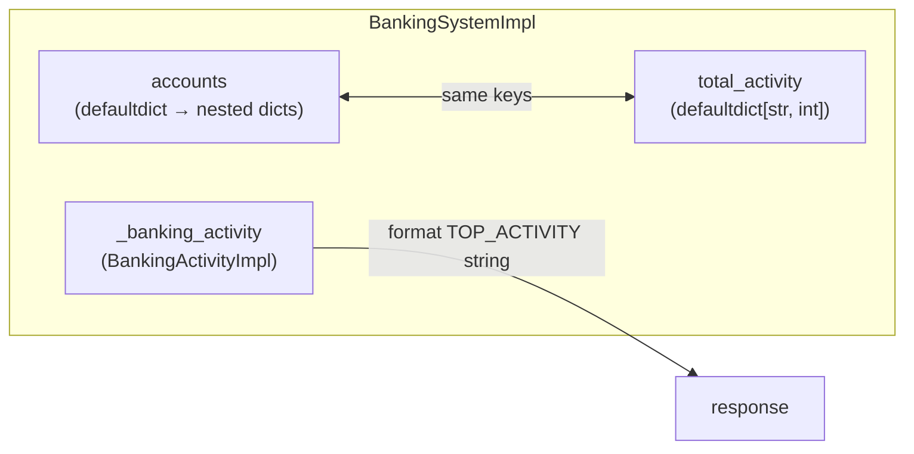
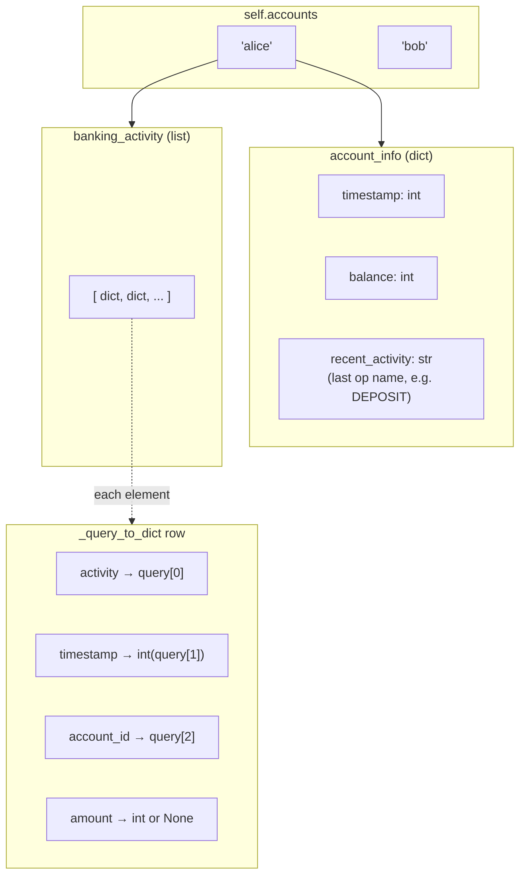
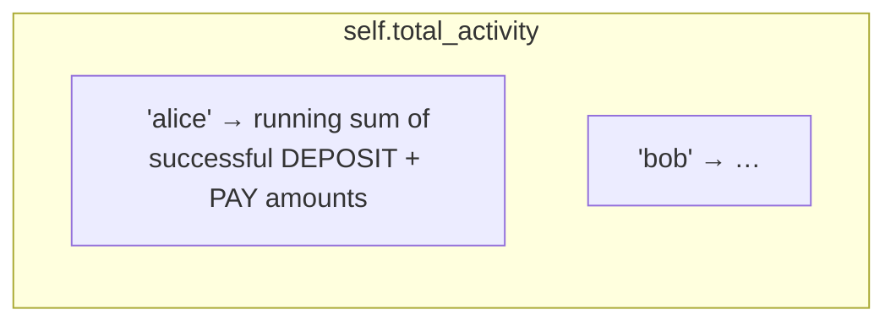
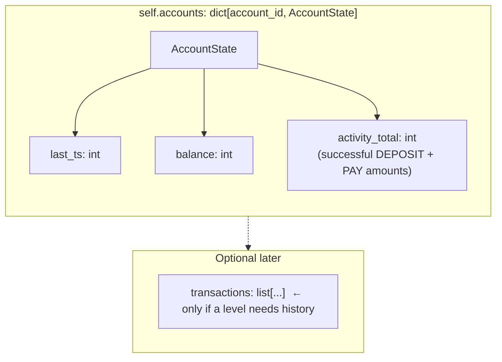

# Banking system — data layout

This note maps how `BankingSystemImpl` stores state today, then proposes a simpler shape for Level 1–2.

---

## 1. Current structure (as implemented)

### High-level picture

Two parallel stores link by **account id**:



### `self.accounts` — nested layout per account id

Each **account id** maps to an inner dict with two top-level keys: `account_info` and `banking_activity`.



### `self.total_activity` — parallel counter map



**Relationship:** For each account id, **`total_activity[id]`** mirrors the spec’s “activity total” (increment on successful `DEPOSIT` / `PAY`). It is **not** derived by scanning `banking_activity` at query time; it is updated incrementally.

### ASCII overview (single account)

```
BankingSystemImpl
├── accounts: defaultdict(dict)
│   └── <accountId>
│       ├── "account_info"
│       │   ├── timestamp: int      ← last successful CREATE/DEPOSIT/PAY time
│       │   ├── balance: int
│       │   └── recent_activity: str  ← last op name (naming ≠ Level‑2 “activity total”)
│       └── "banking_activity"
│           └── [ {activity, timestamp, account_id, amount?}, ... ]
│
├── total_activity: defaultdict(int)
│   └── <accountId> → int           ← Level‑2 rolling sum (DEPOSIT + PAY successes)
│
└── _banking_activity: BankingActivityImpl  ← parse/format helpers for TOP_ACTIVITY
```

---

## 2. Proposed simplified structure

**Goal:** one coherent **per-account record**, no duplicate “activity” concepts, optional history only if you need Level 3+.

### Conceptual model



### ASCII — proposed layout

```
BankingSystemImpl
├── accounts: dict[str, AccountState]
│   └── <accountId>
│       ├── last_ts: int
│       ├── balance: int
│       └── activity_total: int     ← same meaning as today’s total_activity[id]
│
├── activity_helper: BankingActivityImpl   ← TOP_ACTIVITY string formatting only
│
└── (remove) separate total_activity map    ← fold into AccountState.activity_total
    (remove) banking_activity list          ← unless you need an audit trail
    (remove) nested account_info / recent_activity split
```

### What this changes

| Current | Proposed |
|--------|----------|
| `accounts[id]["account_info"]` + `total_activity[id]` | Single struct/value per id: `balance`, `last_ts`, `activity_total` |
| `banking_activity` list of dicts | Drop for Level 1–2; add back if a later level needs history |
| `recent_activity` (string) | Rename to `last_op` or drop if unused |

Ranking for `TOP_ACTIVITY` becomes: sort **account ids** by `(-activity_total, id)` and take the first *n* — no second map to keep in sync.

---

## 3. Summary

- **Today:** nested `account_info` + append-only `banking_activity` **plus** a parallel **`total_activity`** map — works, but three layers of naming (“activity” vs `recent_activity` vs `total_activity`).
- **Proposed:** **one record per account** with **`activity_total`** co-located with **balance** and **last_ts**; keep **`BankingActivityImpl`** only for parsing/formatting **TOP_ACTIVITY** strings.
